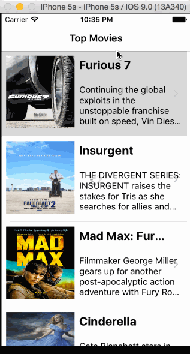

# RottenTomatoes
his is a movies app displaying box office and top rental DVDs using the Rotten Tomatoes API.

Time spent: 12

Features
Required

[done] User can view a list of movies. Poster images load asynchronously.

[done] User can view movie details by tapping on a cell.

[done] User sees loading state while waiting for the API.

[done] User sees error message when there is a network error: http://cl.ly/image/1l1L3M460c3C

[done] User can pull to refresh the movie list.

continueing to work on the optonal stories.

